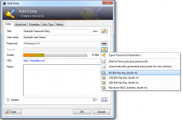

It is recommended to have more than one password, preferably each website / service we are using should have its own unique password. Obviously this is not an easy task to master, especially for websites / services that are only rarely visited. Writeing down the password in an unencrypted text-file is an option, but it is not recommended due to security concerns. Writeing it down on a piece of paper is easy, but one might lose that piece of paper, or worse, somebody else might steal it.

Most WebBrowsers have a built-in password store, though the reliability and security of those built-in stores is often a joke. Therefore, an alternative solution, which stores passwords independently from your Browser and even encrypts them, is recommended.

I personally use and recommend [KeePass Password Safe](http://keepass.info/). It is easy to use and even has the ability to generate passwords, though I will talk about generating (easy) memorable passwords later.

KeePass [claims](http://keepass.info/help/base/security.html) to encrypt the password database using either AES with a 256 bit key or Twofish with a 256 bit key. In addition, a strong key derivation method using SHA-256 and a 128-bit random salt is provided. This is important in the case of a weak master password. I personally use a 15 character long master password which I can easily remember (after years).