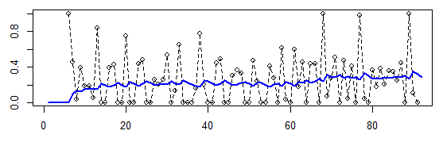

When collecting live data, we often encounter the problem of a high variance within the data. The problem with live data is that we might not be able to store a history of the data. As an example, we might only store the 2 latest measures and update the average value every time.

To avoid a zig-zag curve we can use a weighted (smooth) average with parameter alpha, also called [Moving Average](http://en.wikipedia.org/wiki/Moving_average).

In our case we are storing estimatedValue and measuredValue, and we are updateing estimatedValue in the following matter:

```
estimatedValue <- alpha * measuredValue + (1 - alpha) * estimatedValue
```

This updateing smooths the curve nicely, e.g. for alpha=0.2:

[](http://chkr.at/wordpress/wp-content/uploads/smoothing_levels.png)