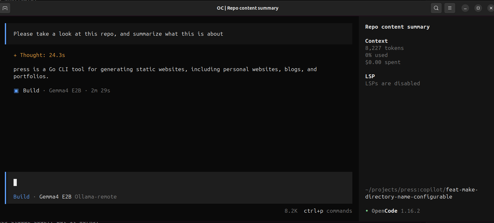

# Using OpenCode and Ollama to run a Coding Agent on my local gaming machine

This post details how I set up a self-hosted LLM environment to experiment with local models, specifically running the model `gemma4:e2b` model via Ollama on my old gaming machine (with a GTX 970).

## Setup

1. **Local LLM Host:** I installed Ollama on my dedicated old Windows gaming machine. You can find installation instructions here: [ollama.com](https://ollama.com/)
2. **Model Hosting:** `gemma4:e2b` is running locally through Ollama via `ollama run gemma4:e2b` (note: I chose this model because it was recommended by another AI that it should work okay-ish with my GTX 970 with 3.5 GB of VRAM available).
3. **Remote Access:** I connect from my dev laptop, using `opencode` (see [opencode.ai](https://opencode.ai)) over HTTP, to interact with the locally hosted model via a configuration file set up in `~/.config/opencode/opencode.json`. This configuration connects to Ollama-remote at `http://<local-ip>:11434/v1` and selects the "Gemma4 E2B" model:

```json
{
  "$schema": "https://opencode.ai/config.json",
  "provider": {
    "ollama-remote": {
      "npm": "@ai-sdk/openai-compatible",
      "name": "Ollama-remote",
      "options": {
        "baseURL": "http://<local-ip>:11434/v1"
      },
      "models": {
        "gemma4:e2b": {
          "name": "Gemma4 E2B"
        }
      }
    }
  }
}
```

4. **Prompt away:** I started `opencode`, typed `/models` to select my Gemma4 E2B model, and then I prompted away.

## Results

Well, my mind was not blown. Anyone with some experience in running local LLMs would probably have told me that my GTX 970 is not good enough. It takes ages for a response to be generated (compared to GitHub Copilot and Anthropics Claude Code). But it works.



## Conclusion

I need a better Graphics Card, if I want to continue on digging this rabbit hole.