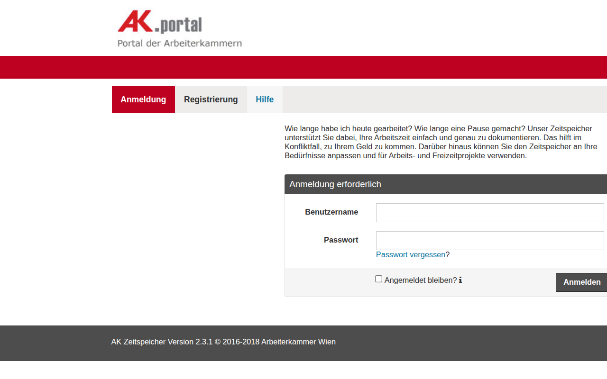

# AK Zeitspeicher — Worker Time Tracking Platform

*Screenshot © 2016–2018 Arbeiterkammer Wien — used for identification/reference purposes*

## Overview

**AK Zeitspeicher** ("Zeit" = time, "Speicher" = storage) is a free online time tracking tool built for the **Arbeiterkammer Wien** (Austrian Chamber of Labor, AK Wien). It enables Austrian workers to precisely document their working hours — an essential tool when pursuing unpaid wages or resolving working-hour disputes through labor law proceedings.

> *"Wie lange habe ich heute gearbeitet? Wie lange eine Pause gemacht? Unser Zeitspeicher unterstützt Sie dabei, Ihre Arbeitszeit einfach und genau zu dokumentieren. Das hilft im Konfliktfall, zu Ihrem Geld zu kommen."*
>
> "How long did I work today? How long was my break? Our Zeitspeicher helps you document your working hours easily and accurately. This helps you get your money in case of a dispute."

## My Role

I was a **software engineer at Anexia**, the company contracted by AK Wien to build and host the platform. I contributed to the development during the 2016–2018 period under the GitHub handle [@anx-ckreuzberger](https://github.com/anx-ckreuzberger). The project is a commercial/proprietary application — no public repository exists.

## What It Does

- Records daily start time, end time, and breaks
- Logs overtime and irregular hours
- Builds a timestamped history usable as evidence in labor disputes
- Free to use — no subscription, no paywall

## Tech Stack

- **Frontend**: Single-Page Application (Angular)
- **Auth**: Username/password with persistent session
- **Hosting**: Anexia infrastructure

## Scale & Impact

- Serves the ~**1.5 million members** of Arbeiterkammer Wien
- Backed by one of Austria's major public-law institutions
- Free public service with social/legal impact for workers
- Version 2.3.1 still running as of April 2026

## Timeline

- **2016–2018** — Development at Anexia (copyright range on the site)
- **2026** — Platform continues to operate at v2.3.1

## Links

- [ak-zeitspeicher.at](https://www.ak-zeitspeicher.at)
- [Arbeiterkammer Wien](https://www.arbeiterkammer.at)
- [@anx-ckreuzberger on GitHub](https://github.com/anx-ckreuzberger)

