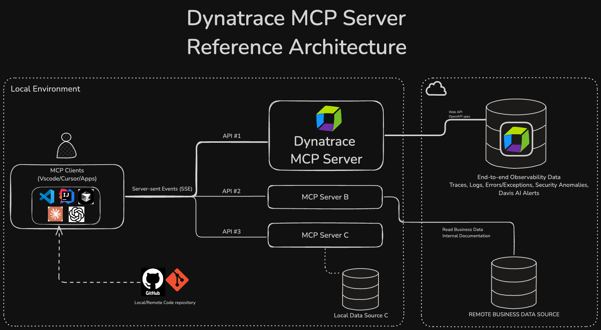

# Dynatrace MCP Server — AI-Native Observability

*Architecture diagram © Dynatrace, used under MIT license*

## Overview

The Dynatrace MCP Server is a local [Model Context Protocol (MCP)](https://modelcontextprotocol.io) server that exposes Dynatrace observability data to AI assistants. It bridges the gap between real-time production telemetry and AI-driven development workflows — letting engineers investigate incidents, analyze problems, and run DQL queries without leaving their IDE or chat client.

As of April 28, 2026, the project entered **maintenance mode**, succeeded by the [Remote Dynatrace MCP Server](https://www.dynatrace.com/hub/detail/dynatrace-mcp-server/).

## My Role

I was the **primary maintainer** — first contributor listed, highest commit count, and CODEOWNERS-listed owner of core architecture assets. In April 2026 alone I authored 28 commits (88% of that month's output). I also authored the maintenance mode transition announcement.

## Capabilities

- Execute **DQL (Dynatrace Query Language)** queries directly from AI clients
- Generate DQL from natural language and explain existing queries
- List and analyze **problems, vulnerabilities, exceptions, and Kubernetes events**
- Multi-phase **incident investigation** with automated impact assessment
- **Deployment health gates** with promotion/rollback logic
- Create **workflow notifications** (Slack, email, events) and Dynatrace notebooks
- Chat with **Davis Copilot** (Dynatrace AI)

## Compatibility

Works with: VS Code GitHub Copilot, Claude Desktop, Cursor, Amazon Q, Amazon Kiro, Windsurf, Google Gemini CLI, ChatGPT.

Available in:
- **Anthropic Claude Marketplace** (via `.mcpb` bundle)
- **Cursor Marketplace**
- As a Gemini CLI extension

## Tech Stack

- **Language**: TypeScript (72.6%), JavaScript (26.2%)
- **Runtime**: Node.js v22.10+
- **Transport**: MCP stdio and HTTP
- **Auth**: OAuth Authorization Code Flow, Platform Tokens, OAuth Client Credentials
- **Build**: esbuild, Vite (React UI for DQL explorer)
- **Testing/Lint**: Jest, ESLint

## Scale

| Metric | Value |
|---|---|
| GitHub stars | 112 |
| Forks | 12 |
| Contributors | 27 |
| Releases | 47 (v0.1.x → v1.8.3) |
| npm package | `@dynatrace-oss/dynatrace-mcp-server` |

## Timeline

- **Mid-2024** — Initial implementation
- **Early 2026** — Active development, broad client support
- **April 23, 2026** — Final release v1.8.3
- **April 28, 2026** — Entered maintenance mode

## Blog Posts

- [**Fueling visual insights with MCP applications for complex data analysis**](https://www.dynatrace.com/news/blog/fueling-visual-insights-with-mcp-applications-for-complex-data-analysis/) *(Dynatrace Blog, February 2026)* — Co-authored with Sharon Sharlin and Benedict Evert. Introduces MCP App support in the Dynatrace MCP server, enabling interactive React-based data visualisation alongside standard text tool responses.

- [**Sky-high developer productivity with Dynatrace MCP and GitHub Copilot**](https://www.dynatrace.com/news/blog/sky-high-developer-productivity-with-dynatrace-mcp-and-github-copilot/) *(Dynatrace Blog, October 2025)* — By Sharon Sharlin; directly features the Dynatrace MCP server. Covers troubleshooting, security vulnerability analysis, new code generation, and CI/CD shift-left via natural-language queries from VS Code.

- [**Bring real-time production insights into Claude Code with the Dynatrace MCP Server**](https://www.dynatrace.com/news/blog/bring-real-time-production-insights-into-claude-code-with-the-dynatrace-mcp-server/) *(Dynatrace Blog, March 2026)* — By Milan Steskal and Christoph Enzinger; features the Dynatrace MCP server as the connector for Claude Code, Cowork, and Chat.

## Links

- [GitHub — dynatrace-oss/dynatrace-mcp](https://github.com/dynatrace-oss/dynatrace-mcp)

