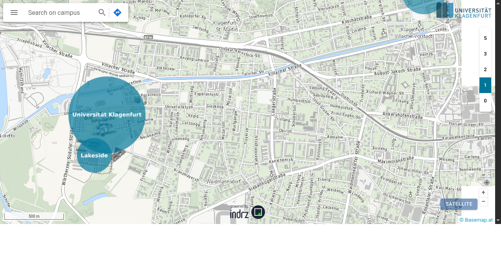
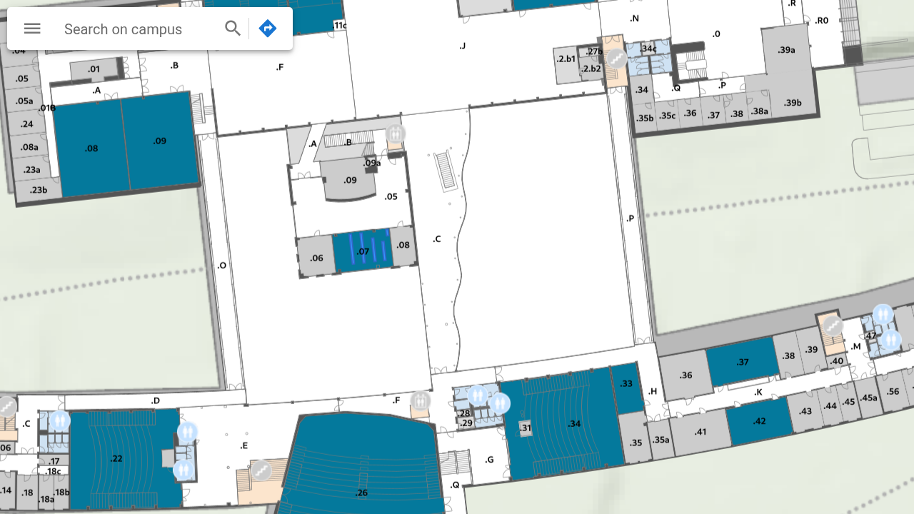

# Campus GIS — Interactive University Campus Maps

*Screenshots show campusplan.aau.at (current successor site) © Universität Klagenfurt — original campus-gis.aau.at built by Gomogi*

## Overview

**Campus GIS** is an interactive, browser-based campus map system built for Austrian universities. It lets students, staff, and visitors navigate university buildings floor by floor, search for rooms and facilities, and get oriented on campus — all in the browser, no app required.

I built this as a developer at **GOMOGI Michael Diener** — a small software company specialising in geographic information systems. Two deployments were created:

- **Alpen-Adria-Universität Klagenfurt** — originally at `campus-gis.aau.at`, now at [campusplan.aau.at](https://campusplan.aau.at/)
- **WU Wien** (Wirtschaftsuniversität Wien) — originally at `gis.wu.ac.at`, now at [campus.wu.ac.at](https://campus.wu.ac.at/)

## My Role

I was the **primary developer** at Gomogi responsible for building and maintaining both deployments. The work spanned from a freelance engagement in 2008 through a part-time position from January 2009 to February 2013.

## What It Does

- Renders an interactive, zoomable campus map using OpenStreetMap data
- Floor-by-floor navigation for multi-storey university buildings
- Room/location search by name or function
- Covers multiple campus locations (main campus, Lakeside Park at AAU; main WU campus at WU Wien)

## Tech Stack

- **Frontend**: JavaScript, [OpenLayers](https://openlayers.org/) (open-source mapping library)
- **Map data**: OpenStreetMap (CC-BY-SA)
- **Backend**: PHP
- **Hosting**: On-premise at the respective universities

## Timeline

- **2008** — First freelance engagement at Gomogi
- **2009–2013** — Part-time employee; built and maintained both campus GIS deployments
- **2026** — Both universities still run campus map systems at the same URLs (now powered by indrz)

